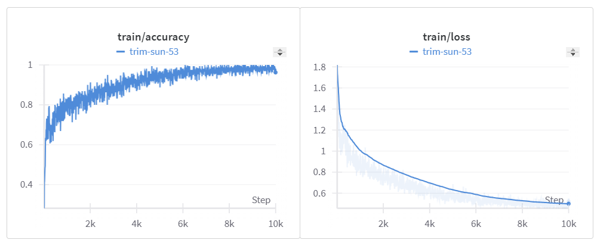
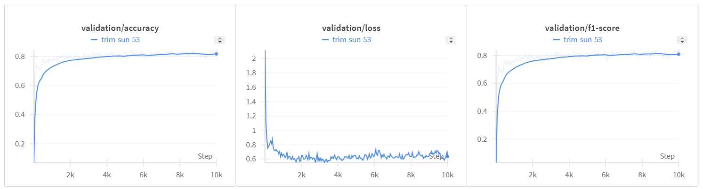
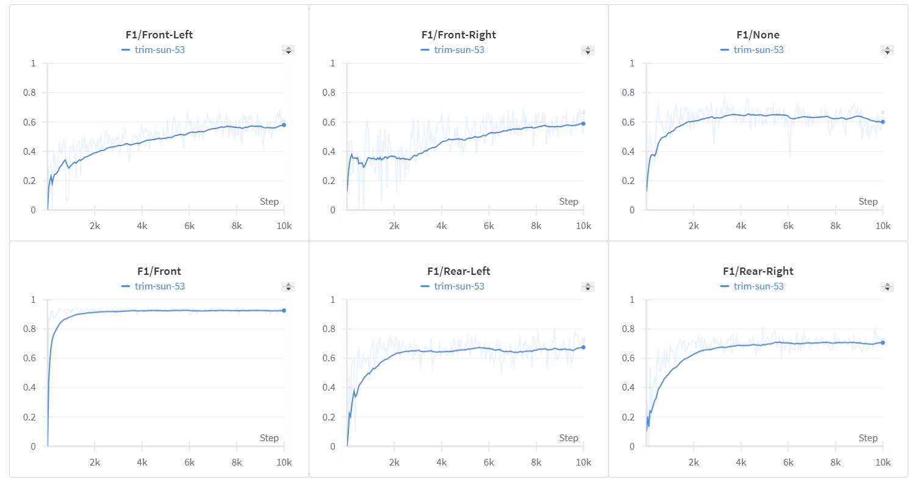
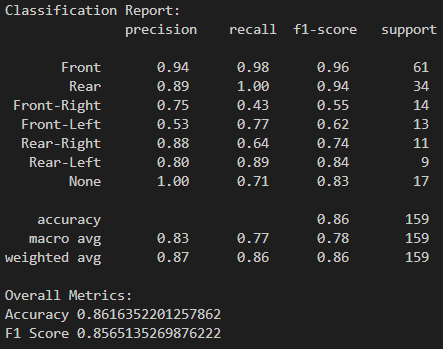

# **Car Viewpoint Classification Project**

## **Project Overview**
This project classifies car images into six viewpoints (Front, Front-Left, Front-Right, Rear, Rear-Left, Rear-Right) with an additional "None" class for irrelevant or ambiguous images. It includes a robust pipeline for preprocessing, model training, and optimization for edge deployment.

---
## **Tasks and Milestones**

1. **Project Setup**:
   - [x] Create the GitHub repository.
   - [x] Define the project structure and dependencies.

2. **Data Preparation**:
   - [x] Analyze and clean the dataset.
   - [X] Develop a data loader and augmentation pipeline.

3. **Model Development**:
   - [X] Design the initial model and implement training and validation loops.
   - [X] Experiment with initial architectures and changing hyperparameters.
   - [X] Add tool for faster convergence

4. **Iterative Refinement**:
   - [x] Address class imbalances and improve performance on edge cases.
   - [x] Fine-tune augmentations and model configurations.

5. **Model Optimization**:
   - [x] Convert into optimized format i.e. TFLite.
   - [x] Test for latency and accuracy.


---
## **Setup**

```bash
conda create --name viewpointcq python=3.11 -y
pip install torch torchvision --index-url https://download.pytorch.org/whl/cu118
pip install -r requirements.txt
```

---
## **Download Model**
```bash
mkdir -p lite_models/viewpoint  # Ensure the directory exists
wget -P lite_models/viewpoint https://huggingface.co/omrastogi/viewpoint/resolve/main/convnext.tflite
```

---
## **Inference**
```bash
python test_predict.py \ 
--folder data/5e9112c35026365e15eb871b \
--model lite_models/convnext.tflite \
--csv results.csv
```

---
## Prepare Dataset 
```bash
python scripts/preprocess_ann.py
```
---
## **Train**

```bash
CUDA_VISIBLE_DEVICES=0 python scripts/train.py --base_data_dir data \
                --train_data_path data/training_data.json \
                --val_data_path data/val_data.json \
                --batch_size 8 \
                --learning_rate 0.0005 \
                --num_iterations 10000 \
                --log_interval 5 \
                --val_interval 50 \
                --checkpoint_interval 1000 \
                --grad_accumulation 4 \
                --unfreeze_interval 400 \
                --resize_to 380 380 \
                --device cuda
```
---
#### Training

#### Validation

#### Vaidation F1 Score


---
## **Evaluation**
```bash
python scripts/evaluate.py --test_data_path data/test_data.json \
                   --checkpoint_path checkpoints/convnext/checkpoint_iter_5000.pth \
                   --base_dir data \
                   --resize_to 380 380 \
                   --batch_size 32
```
```
Overall Metrics:
Accuracy 0.86
F1 Score 0.85
```
## Evaluation Report 



---
## **TFLite Conversion**
Convert a model to tflite in the following way
```bash
python src/tflite/convert_to_tflite.py \
    --checkpoint_path checkpoints/checkpoint_iter_5000.pth \
    --output_path lite_models/convnext.tflite \
    --input_size 380 \
    --num_classes 7 
```
Inference the tflite
```bash
python src/tflite/infer_tflite.py \
   --model_path lite_models/convnext.tflite \ 
   --image_path data/5f4dd0caf0b0b46649993480/scraped_0n61nM_1598934146856.jpg
```

---
## **Key Challenges**
- Handling ambiguous and overlapping viewpoints.
- Ensuring robust performance for the "None" class with limited data.
- Optimizing the model for real-time inference on edge devices.


---
## **Future Scope**
- Extend the model for additional car viewpoints or object detection.
- Incorporate real-time feedback mechanisms for further deployment enhancements.

---

#### Extras 

Create requirements.txt:
```
pip freeze | findstr /V " @ file://" > requirements.txt
```

#### Training Runs: 
1. MobileNetV2: https://wandb.ai/omegam/my_car_classification_project/runs/x06uzfsc?nw=nwuseromegam 

2. EfficientNetB4: https://wandb.ai/omegam/my_car_classification_project/runs/toev44gf?nw=nwuseromegam
---